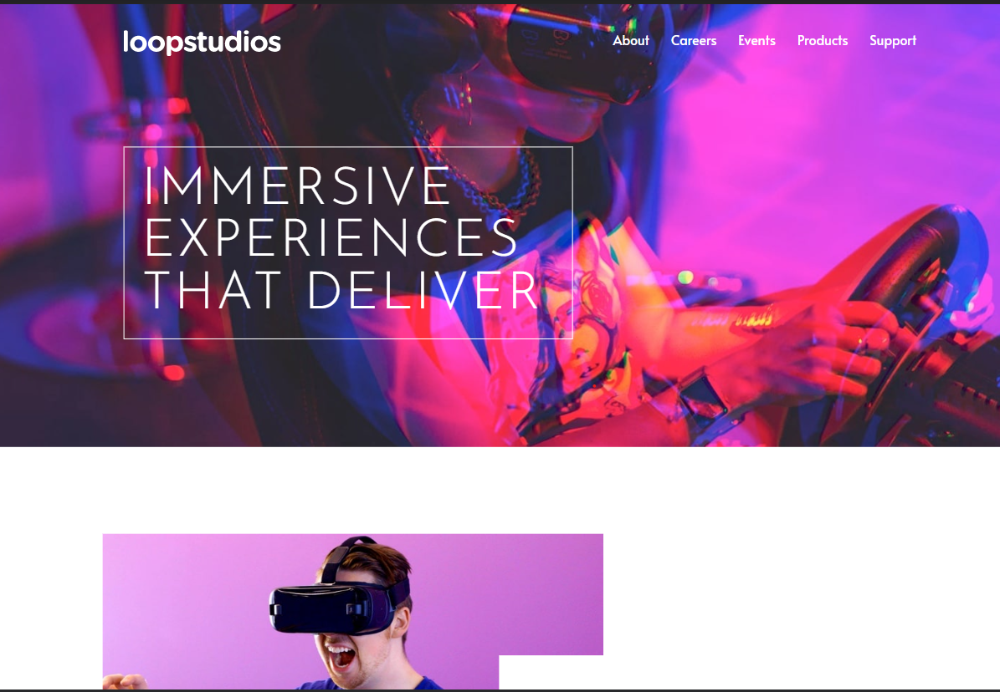
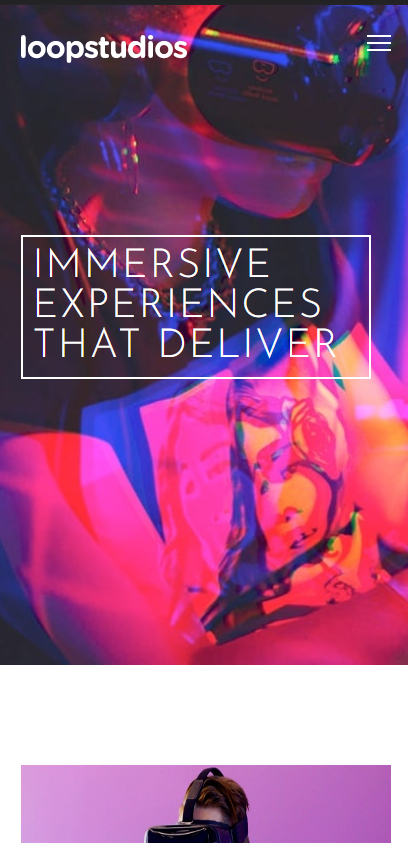
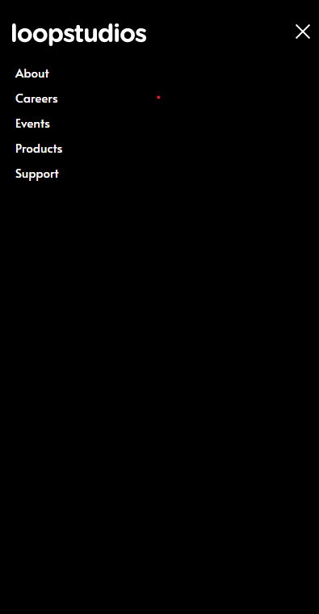

# Mentor de Frontend - Solução de página de aterragem Loopstudios

Esta é uma solução para o [Loopstudios landing page challenge on Frontend Mentor](https://www.frontendmentor.io/challenges/loopstudios-landing-page-N88J5Onjw). Os desafios do Frontend Mentor ajudam-no a melhorar as suas capacidades de codificação através da construção de projectos realistas. 

## Tabela de conteúdos

- [Visão Geral](#overview)
  - [O Desafio](#o desafio)
  - [Captura de ecrã](#screenshot)
- [Ligações](#my-process)
- [Autor](#autor)

## Visão geral

### O desafio

Os utilizadores devem ser capazes de o fazer:

- Ver o layout óptimo do site, dependendo do tamanho do ecrã do seu dispositivo
- Ver os estados de flutuação para todos os elementos interactivos na página

### Imagem de ecrã

### Ligações

- URL da solução: [Adicione aqui o URL da solução](https://your-solution-url.com)
- URL do sítio em directo: [Adicione aqui o URL do sítio em directo](https://your-live-site-url.com)

## O meu processo

#### Construído com

- HTML5 
- CSS
- Flexbox
- grid CSS
- Javascript

## Autor

- Website - [Renato](https://www.your-site.com)
- Frontend Mentor - [@SirReinato](https://www.frontendmentor.io/profile/yourusername)
- Twitter - [@SirReinato](https://www.twitter.com/yourusername)

